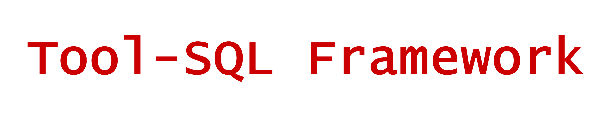
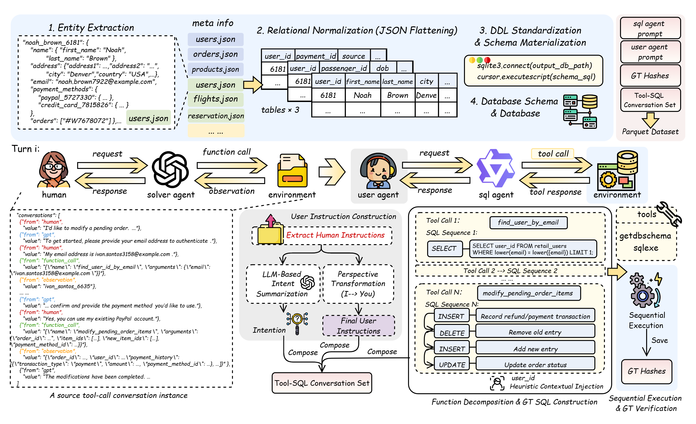

<div align="center">
  <picture>
      
  </picture>
</div>

<div align="center" style="line-height: 1;">

[]()
[](https://github.com/Zzzyxii/Tool-SQL)
[]()
[]()

</div>

# Introduction

This repository contains the framework of tool-sql multiturn text2sql task. **Assistant Agents** trained by our method were released, with the training dataset. The system enables taining a Large Language Model (LLM) with multiturn method based on verl and sglang, and introduced the path to get tool-sql dataset via our data preprocess pipeline.

<div align="center">
  <picture>
      
  </picture>
</div>

## 📂 Module Architecture

| File | Description |
| :--- | :--- |
| `examples/sglang_multiturn/grpo_8b.sh` | Main training script for GRPO |
| `scripts/merge.sh` | Checkpoint conversion script |
| `scripts/model_merger.py` | Model format conversion utilities |
| `verl/workers/rollout/sglang_rollout/` | Core rollout implementation |
| `verl/workers/rollout/schemas.py` | Conversation management and backpropagation control |
| `verl/utils/reward_score/sqlbench.py` | Reward Design |
| `MUA_environments/` | Environment management system |
| `verl/tools/sqlbench_apigen/` | Database and schema |
| `data/` | Dataset Parquets |

## ✨ Features

- 🔄 **Multi-turn Conversation Support**: Maintain context across multiple conversation turns for complex task completion
- 🛠️ **Agentic Tool Usage (SQL)**: Seamless integration with various tools and APIs for real-world applications
- 📊 **Flexible Environment Management**: Dynamic environment creation for each rollout to ensure fresh context
- 🔧 **Easy Checkpoint Conversion**: Automatic conversion from distributed checkpoints to Hugging Face format
- 🛠️ **Unified Data Transformation**: Automatic Transformation from tool-use or conversation to Tool-SQL format

## 🚀 Quick Start

### 1. Installation

#### Prerequisites
- Python 3.8+
- CUDA 11.8+ (for GPU training)
- PyTorch 2.0+

#### Quick Install

```bash
# Clone the repository
git clone https://github.com/Zzzyxii/Tool-SQL.git
cd Tool-SQL

# Install dependencies
pip install -e .
pip install -r requirements_sglang.txt
pip install transformers==4.51.1
```

### 2. Configure Training

Edit the training script parameters:

```bash
# Edit model path and other parameters in the script
vim examples/sglang_multiturn/grpo_8b.sh
```

#### Key Parameters to Modify:

| Parameter | Description | Example |
|-----------|-------------|---------|
| `MODEL_PATH` | Path to your base model | `/path/to/your/model` |
| `N_NODE` | Number of nodes for distributed training | `4` |
| `BATCH_SIZE` | Training batch size | `32` |
| `EPOCH_NUM` | Number of training epochs | `30` |
| `API_KEY` | OpenAI API key for evaluation model | `sk-...` |
| `BASE_URL` | OpenAI API base URL | `https://api.openai.com/v1` |
| `CKPT_DIR` | Directory path to save model checkpoints | `/path/to/checkpoints` |
| `TENSORBOARD_DIR` | Directory path for TensorBoard logs | `/path/to/tensorboard` |
| `ROLLOUT_LOG_PATH` | Directory path for rollout generation logs | `/path/to/rollout_logs` |
| `VALID_LOG_PATH` | Directory path for validation logs | `/path/to/validation_logs` |

### 3. Run Training

#### Multi-Node Training (4 * 8 GPUs)

```bash
# For 2*8 GPU setup, suggest H20 96GB
bash examples/sglang_multiturn/grpo_8b.sh
```


### 4. Convert Checkpoints to Hugging Face Format

After training, convert distributed checkpoints to Hugging Face format:

```bash
# Edit the merge script configuration
vim scripts/merge.sh

# Set your model path and name
BASE_DIR="/path/to/your/checkpoints/"
MODEL_NAME="your_model_name"

# Run the conversion
bash scripts/merge.sh
```

The script will automatically:
- 🔍 Find all `global_step_*` directories
- 🔄 Convert FSDP/Megatron checkpoints to Hugging Face format
- 💾 Save merged models to `iter_XXXXXX/actor/unify_checkpoint/`

```bash
pip install openai playwright beautifulsoup4 lxml Pillow
playwright install chromium 
```
## 🏗️ Architecture

MUA-RL follows a modular architecture designed for scalability and flexibility:

- **Environment Manager**: Creates fresh environments for each rollout
- **Tool Registry**: Manages available tools and their configurations
- **Data Loader**: Handles data loading and preprocessing
- **Rollout Worker**: Executes multi-turn conversations with tool usage

## 📊 Experimental Results

We evaluated the model trained by this method against several baseline model (GPT-4o, Qwen3-8B, Qwen3-4B) across multiple benchmarks. Some of the results are presented here:

<div align="center">
  <p><b>1. Performance on our...</b></p>
  
</div>

<br>

<div align="center">
  <p><b>2. Performance on DynSQL-Bench</b></p>
  
</div>

<br>

<div align="center">
  <p><b>3. Performance on CoSQL Bench</b></p>
  
</div>

## 🙏 Acknowledgments
- Thanks to the open-source community for the excellent tools and libraries
- Special thanks to [MUA-RL](https://github.com/zzwkk/MUA-RL)

## Citation